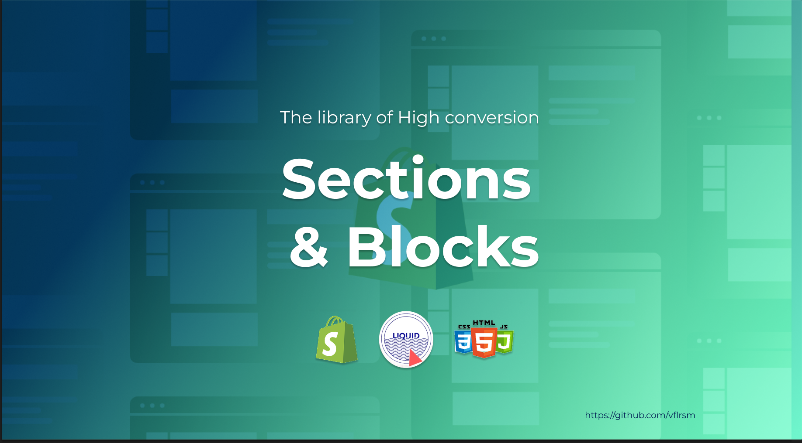

# Shopify Sections & Blocks

This repository contains a collection of reusable Shopify sections and blocks designed to enhance your Shopify store's functionality and design. Each section and block is modular, customizable, and easy to integrate into your Shopify theme.

**Developed by**: [Deval](https://www.linkedin.com/in/deval)  
**Current version**: v1.0

## Installation

1. Clone this repository to your local machine:
    ```bash
    git clone https://github.com/vflrsm/shopify-sections-blocks.git
    ```
2. Copy the desired section or block files into your Shopify theme's `sections` or `snippets` folder.
3. Include the section or block in your `theme.liquid` file or relevant template files.

## Usage

1. Go to your Shopify admin panel.
2. Navigate to **Online Store > Themes > Customize**.
3. Add the new section or block to the desired page and configure its settings.

## Contributing

Contributions are welcome! If you have a new section or block to share, feel free to submit a pull request. Please ensure your code follows Shopify's Liquid and theme development guidelines.

## License

This project is licensed under the MIT License. See the [LICENSE](LICENSE) file for more details.

## Contact

For inquiries or support, please contact me at [valleryfloresmontero@gmail.com](mailto:valleryfloresmontero@gmail.com).
